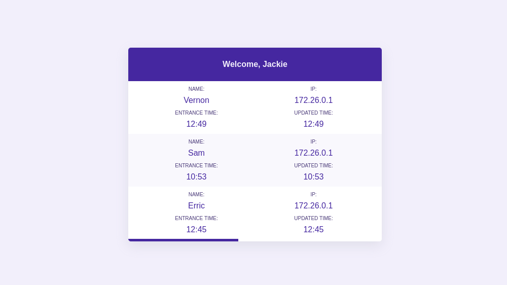

# Live Users Dashboard

A test application that shows the current active users. [Live Demo](http://134.122.106.240/)

## Local Development Setup

- Copy the configuration file `./config-sample.js` to `./config.js`.
- Run `docker-compose up`
- Open [localhost:8080](http://localhost:8080)
